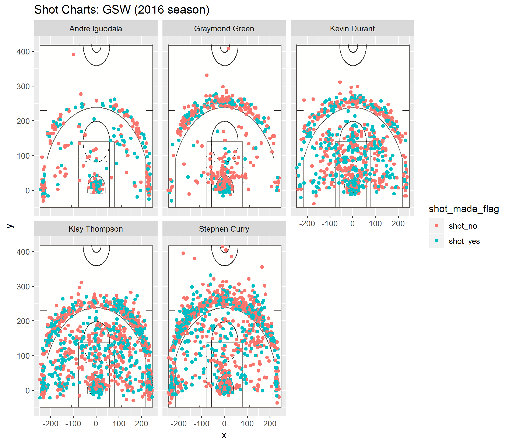

```{r}
library(readr)
library(dplyr)
library(ggplot2)
library(jpeg)
library(grid)
shots_data <- read.csv('../data/shots-data.csv')
twoPT_Effective_Shooting <- arrange(
  summarise(
    group_by(shots_data, name),
    total = sum(shot_type == '2PT Field Goal'),
    made = sum((shot_type == '2PT Field Goal' & shot_made_flag == 'shot_yes')),
    perc_made = made/total),
  desc(perc_made)
)
twoPT_Effective_Shooting
threePT_Effective_Shooting <- arrange(
  summarise(
    group_by(shots_data, name),
    total = sum(shot_type == '3PT Field Goal'),
    made = sum((shot_type == '3PT Field Goal' & shot_made_flag == 'shot_yes')),
    perc_made = made/total),
  desc(perc_made)
)
threePT_Effective_Shooting
Effective_Shooting <- arrange(
  summarise(
    group_by(shots_data, name),
    total = sum((shot_type == '2PT Field Goal' | shot_type == '3PT Field Goal')),
    made = sum(((shot_type == '2PT Field Goal' | shot_type == '3PT Field Goal') & shot_made_flag == 'shot_yes')),
    perc_made = made/total),
  desc(perc_made)
)
Effective_Shooting
```

```{r out.width='80%', echo=FALSE, fig.align='center'}

```

# *Narrative:*

I still remember, on 2017 July 4th in China, when I went home after working out around 10 pm. Earlier, like many people, I thought that Durant had the highest probability of staying in the Oklahoma City Thunder. But when it was close to 11 o'clock, Twitter Yahoo released the news that Durant joined the Oklahoma City Thunder. The news was overwhelmedand have disturbed my thought. Other people in my basketball interest group chat have already gone asleep , because they believe that what I thought were things that seem to be nailed to the board. At 11 o'clock, new tweets are still being posted. The ending is very clear at this point. Sure enough, Durant chose to join the Warriors.

After the news came out, I talked a few words in the group, then turned off the phone to sleep, and has been tossing and turning, and it is difficult to sleep. I woke up at 7:30 in the next morning. With poor sleep quality, my feelings are mixed in the next day: excited, and lost. I certainly want to see how wonderful the three great shooters of today are. But what I thought more about at the time was that the Warriors won 73 games last season. They are already so strong, why do they want Durant? The arrival of Durant certainly makes the Warriors even more powerful, but is it really worth happy? Aren't the hardships encountered during the process to success a joy? Why are the 2011 and 2016 championships so shocking? Isn¡¯t it because of the fearsome strength of the opponent? Watching a team grow strong step by step, it is much more happier than building a star lineup overnight.

In 2010, James's decision triggered perhaps the biggest transfer dispute in NBA history. But now, Durant's transfer has more to shake people's perceptions. He went to a 73-win team and chose a closer and more visible road to victory. In addition, this team just beat him in the playoffs, and the Warriors' three giants are all under 28 years old. This decision reveals a stronger "results than everything" signal than James's transfer. It can be seen that Durant could wait no longer. Staying in the Thunder is actually a safe option, and he did chose this controversial road.

In the Thunder's nine years, Durant averaged 27.4 points, 8.1 rebounds and 3.7 assists per game. But I always think that Durant's participation on the offensive end has not been completely released. Therefore, I have always supported Durant to leave the Thunder. The Thunder almost beat the Warriors in order to get into the finals this year. But with the top five players in the league, the Thunder's regular three-point percentage is only 35%. Thus, from the perspective of Basketball, Durant joining the Warriors is a perfect deal.

In this recruitment, Curry played a big role. On the same day, he participated in a meeting with Durant. After the meeting, Curry also sent a message to Durant, saying that he did not care who is the team's signature player, nor did he care who got the most recognition, not to care who sold the most shoes, and Curry told Durant: if Durant gets the MVP, he will applaud him in the first row of Durant¡¯s MVP press conference. Finally, Curry said that he only cares about winning, and he hopes to do this with Durant.

Curry was already in the Warriors, so he didn't have to be too controversial because of Durant's joining. 

Perhaps, we are all too attached to impression that all the stars should be like Jordan, who would rather lose than cooperating with sworn competitors. However, the world has changed. Both Curry and Thompson were born in the second generation of the Stars, and there is no such desire to rule. They will continue to improve themselves and be eager to win, but they don't necessarily care if they get the most fame.

You and I may not like this situation, but remember that polymorphism is the source of happiness. We need Jordan and Kobe's idols, but without the saying that "basketball itself is a pleasure, nothing to do with winning or losing," the world will lose a lot of fun and diversity.